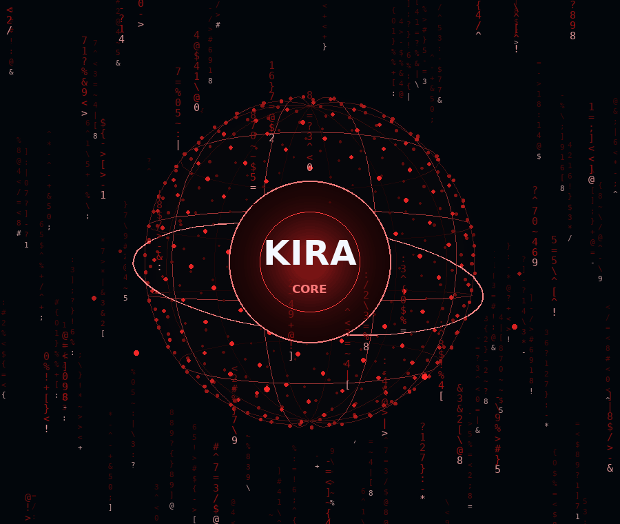

# KIRA — Local AI Computer Agent

**KIRA** is a fully local, voice-controlled desktop assistant for Windows.
Talk to it in **English, French, or Arabic** and it opens apps, searches the
web, types, presses keys, manages windows and media, reads your clipboard,
reports system status — and can even *see your screen*: it locates a visible
UI element with a vision model, clicks it, and verifies the result.

Everything runs on your machine. No cloud APIs, no API keys, no telemetry.

```
 you ──► mic ──► Vosk/Google STT ──► rule-based parser ─┬─► action done ✓
                        │                               │
                        │                         no match? ▼
                        │                        THINK: recall agent memory
                        │                          │ no hit ▼
                        │                       plan via Ollama LLM (qwen3)
                        │                          │ thought → action ✓
                        │                        ACT ──► execute
                        │                          │
                        │                        REFLECT ──► episode log +
                        │                     strengthen/demote the learning
                        │
                        └────────── chat question ──────► chat LLM
                                        SQLite memory ◄──┤
```

## Highlights

- **Fully local** — chat via [Ollama](https://ollama.com) (`qwen3:0.6b` by
  default), vision via `qwen3-vl:2b`, offline speech recognition via Vosk,
  offline text-to-speech via Windows SAPI (`pyttsx3` fallback).
- **Trilingual** — commands and conversation in English, French and Arabic.
- **A real thinking process** — commands the parser can't handle go through
  *think → act → reflect*: KIRA recalls similar past successes first, plans
  with the local model inside an explicit `{"thought", "action"}` envelope
  (the thought appears in the UI/log, never spoken), validates every plan
  against an action whitelist, then reflects on the outcome.
- **Its own agent memory** — separate from user facts. KIRA keeps *episodes*
  (what it understood, did, and how it went) and *learnings* (command →
  action mappings that worked). Repeated successes get instant recall;
  failures demote a mapping so it stops repeating mistakes (reflexion).
  Ask it: **"what did you learn?"** — reset with **"forget what you learned"**.
- **Layered command routing** — a fast deterministic parser handles ~100
  built-in phrases; anything ambiguous falls to the thinking mind, and
  questions fall to the chat personality.
- **Proactive watchdog** — a lightweight background monitor watches battery,
  CPU, memory and disk, and *speaks up unasked* when something strains
  ("Sir, I should mention the battery is at 15 percent."), with cooldowns so
  it never nags. Toggle with **"enable/disable watchdog"**.
- **Morning briefing & self-awareness** — KIRA boots with a status banner and
  a spoken briefing (time, date, battery, pending reminders), answers
  **"systems check"** with its own uptime/success-rate/skill count,
  **"review your day"** with an honest daily recap, and
  **"what do I usually do now?"** with habits detected from its episodes.
- **Teach KIRA a trick** — say **"learn this routine"**, perform a series of
  commands, then **"call it deploy mode"**: the whole sequence becomes a
  named shortcut. Wrong action? **"no, not that one"** demotes it (reflexion
  from the human side). After enough successes KIRA offers to promote a
  learning into a permanent shortcut — answer **"make it a shortcut"** or
  **"skip the shortcut"**.
- **Lab protocols** — **"secure the lab"** locks the workstation behind a
  voice gate (optional passphrase); **"eyes down"** hides everything for
  privacy; **"take that back"** reverses reversible actions (typing, volume,
  mute, media).
- **Personality with a dial** — `personality.humor` in the config chooses
  *neutral*, *dry* (JARVIS-style wit) or *formal*; greetings follow the time
  of day.
- **Optional bridges** — ask the weather (`wttr.in`, opt-in), or control
  Home Assistant devices by name ("turn on the desk lamp") — both are
  completely inert until configured.
- **Builds projects and actually tests them** — give KIRA an idea
  (*"build me a project that tracks my expenses"*) and it plans the project,
  writes every file, runs the tests for real, and repairs its own failures
  with the error output. It never claims success unless the tests passed.
- **Screen vision with verification** — "find the save button and click it":
  KIRA screenshots, asks the vision model for coordinates, clicks at ≥70%
  confidence, then compares before/after screenshots to confirm it worked.
- **Persistent memory** — remembers your name, preferences and past messages
  in a local SQLite database; deterministic recall for personal facts.
- **Built-in calculator** — "what is 15% of 200", "calculate 2 to the power
  of 10", in three languages, evaluated through a safe AST whitelist.
- **Voice reminders** — "remind me in 10 minutes to call mom" sets a real
  timer that speaks back when it fires (English, French and Arabic).
- **Configurable everything** — your own app aliases, websites and
  confirmation rules live in `kira_config.json`, not in code.
- **3D holographic core** — the interface centrepiece is a real
  perspective-projected orb: a 430-point depth-sorted sphere, six meridians
  and four latitude rings (each shaded by depth), an equatorial scan ring,
  3D orbiting satellites, and a glowing heart behind the KIRA wordmark —
  all wrapped in **two layers of matrix rain** (dense/dim behind, sparse/
  bright in front) so the sphere sits *inside* the rain. Six UI states drive
  spin, tilt, pulse, rain speed and hue.
- **Browser interface** — the same agent in a Three.js neural HUD
  (`python kira_server.py`): a live reactor that reacts to what KIRA is doing,
  matrix rain, real telemetry, the conversation with its thoughts, a
  confirmation bar for sensitive actions, voice input through KIRA's own
  microphone and replies spoken by the browser. Works on your phone over the
  LAN too — `--host 0.0.0.0`.
- **Safe by default** — sensitive actions (web search, mouse clicks, locking
  the PC) ask for voice confirmation; destructive steps fail loudly.

## Requirements

| Requirement | Notes |
|---|---|
| Windows 10/11 | Linux/macOS can run the parser/tests, but the full agent targets Windows |
| Python 3.10+ | 64-bit |
| [Ollama](https://ollama.com/download) | must be running (`ollama serve`) |
| Microphone + speakers | for voice mode; the UI also accepts typed commands |

## Quick start

```powershell
git clone https://github.com/zak001-afk/kira.git
cd kira
python -m venv .venv
.venv\Scripts\activate
pip install -r requirements.txt

# Pull the LLM/vision models and (optionally) an offline speech model:
python scripts/setup_models.py

# Run KIRA:
python main_window.py

# ...or in a browser (same agent, different HUD):
python kira_server.py --open
```

`scripts/setup_models.py` checks that Ollama is up (starts it if needed),
pulls the models referenced by `kira_config.json`, and can download a small
Vosk model + point `offline_model_path` at it.

## Voice commands

Wake word **"kira"** is optional by default (`require_wake_word`). A separator
after the wake word is fine: *"kira, open chrome"*, *"kira: open chrome"*.

| Say (EN) | Say (FR) | Say (AR) | Action |
|---|---|---|---|
| open chrome | ouvrir chrome | افتح كروم | launch an app (aliases for notepad, calc, paint, vscode…) |
| open youtube | — | — | open a website |
| open folder projects | ouvrir le dossier … | افتح مجلد … | open a folder |
| search weather in Tunis | recherche la météo | ابحث عن الطقس | web search *(asks confirmation)* |
| type hello world | écris bonjour | اكتب مرحبا | type text into the focused window |
| press enter | appuie entrée | اضغط … | press a key |
| open chrome and search x | — | — | chained sequence |
| close window / minimize / maximize | ferme la fenêtre … | اغلق النافذة … | window management |
| volume up / down / mute | monte le volume … | ارفع الصوت … | volume & media keys |
| play pause / next track | lecture | تشغيل | media control |
| lock pc | verrouille | قفل الكمبيوتر | lock workstation *(asks confirmation)* |
| copy / paste / read clipboard | copier / coller | نسخ / لصق | clipboard |
| screenshot | capture d'écran | لقطة شاشة | save `kira_screenshot.png` |
| system info | état du système | معلومات النظام | CPU / RAM / battery report |
| time / date | quelle heure est-il | كم الساعة | clock |
| work mode | — | — | run your configured shortcut |
| call me commander | appelle-moi … | نادني … | change how KIRA addresses you |
| remember my browser is firefox | — | — | persist a preference |
| what is my name | — | — | deterministic memory recall |
| forget my name | — | — | delete a stored fact |
| what's on my screen | qu'est-ce qu'il y a sur mon écran | ماذا يوجد على الشاشة | vision: describe the screen |
| find the save button and click it | trouve le bouton et clique | — | vision: locate → click → verify |
| conversation mode / stop conversation | mode conversation | وضع المحادثة | toggle chat mode |
| what did you learn | qu'as-tu appris | ماذا تعلمت | KIRA reports its learned commands |
| forget what you learned | oublie ce que tu as appris | انس ما تعلمته | wipe the agent's learnings |
| systems check / how are you | comment vas-tu | كيف حالك | KIRA reports its own status |
| review your day | bilan de ta journée | راجع يومك | daily self-review of episodes |
| what do i usually do now | que fais-je d'habitude maintenant | ماذا أفعل عادة الآن | habit hint from episode history |
| enable / disable watchdog | active / arrête la surveillance | شغل / أوقف المراقبة | background system monitor |
| learn this routine | apprends cette routine | تعلم هذه الحركة | begin macro recording |
| call it <name> | appelle-la <nom> | سمها <اسم> | save the recording as a shortcut |
| stop learning | arrête d'apprendre | توقف عن التعلم | discard the recording |
| no, not that one | pas celle-là | ليس هذا | correct the last action (demotes it) |
| make it a shortcut / skip the shortcut | crée ce raccourci / pas de raccourci | أضف الاختصار / تجاهل الاختصار | answer the promotion offer |
| secure the lab | verrouille le labo | أمّن المختبر | lock behind the voice gate |
| unlock the lab <passphrase> | déverrouille le labo <phrase> | افتح المختبر <كلمة> | leave the locked lab |
| eyes down / privacy mode | mode discrétion | وضع الخصوصية | hide everything + mute |
| take that back / undo | annule ça | تراجع | reverse the last reversible action |
| weather in <city> | météo à <ville> | الطقس في <مدينة> | opt-in weather report |
| turn on / off <device> | allume / éteins <appareil> | اطفئ <جهاز> | Home Assistant (when configured) |
| build me a project that … | crée un projet qui … | أنشئ مشروعا … | build, test and self-repair a real project from an idea |
| fix the project | répare le projet | أصلح المشروع | re-run the last project's tests and repair failures |
| list my projects | liste mes projets | اعرض المشاريع | show the projects KIRA has built |
| calculate 2 to the power of 10 | calcule dix fois trois | كم يساوي ١٢ ضرب ٢ | safe local arithmetic (words & % work) |
| open github / gmail / netflix | ouvrir netflix | — | known websites (extendable in config) |
| remind me in 5 minutes to call mom | rappelle-moi dans 2 heures de … | ذكرني بعد 10 دقائق … | set a spoken reminder |
| list reminders / cancel reminders | mes rappels / annule les rappels | تذكيراتي / الغ التذكيرات | manage reminders |
| clear chat | efface la conversation | محادثة جديدة | new conversation |
| exit | au revoir | خروج | quit |

Anything the parser doesn't recognize is sent to the local LLM, which maps it
to one of the allowed actions — or, if it reads as a question, to the
conversational chat mode with your stored memories as context.

## Configuration

`kira_config.json` (all keys optional — defaults are merged at load):

```jsonc
{
  "model": "qwen3:0.6b",          // chat/command LLM (Ollama tag)
  "vision_model": "qwen3-vl:2b",  // vision LLM for screen understanding
  "vision_click_confidence": 0.7, // minimum confidence before a visual click
  "require_wake_word": false,     // only react to "kira …" when true
  "conversation_mode": false,     // start in chat mode
  "chat_history_limit": 12,       // messages kept in the rolling context
  "preferred_address": "sir",     // sir, commander, captain, madam… (see ADDRESS_OPTIONS)
  "offline_model_path": "",       // absolute path to a Vosk model folder
  "app_aliases": {},              // your apps:  "notion": "notion.exe"
  "websites": {},                 // your sites: "my blog": "https://…"
  "require_confirmation": [       // actions that ask before executing
    "search", "mouse_move", "click", "lock_pc"
  ],
  "shortcuts": {                  // voice-triggered sequences
    "work mode": [
      {"action": "open_app", "target": "vscode"},
      {"action": "open_app", "target": "chrome"}
    ]
  },
  "personality": { "humor": "charming" }, // charming | neutral | dry | formal
  "builder_model": "",            // optional stronger model for project builds
  "orb_quality": "balanced",      // UI render budget: high | balanced | low
  "projects_dir": "",             // default: ~/KIRA Projects
  "skill_promote_after": 10,      // successes before KIRA offers a shortcut
  "lab_passphrase": "",           // optional passphrase for "unlock the lab"
  "monitor": {                    // proactive watchdog (all optional)
    "enabled": true,
    "interval_seconds": 60,
    "battery_below": 20,          // percent, only while discharging
    "cpu_above": 90.0,            // percent…
    "cpu_sustained_checks": 3,    // …for this many consecutive samples
    "memory_above": 92.0,
    "disk_below_gb": 5.0,
    "cooldown_seconds": 600       // per-alert silence period
  },
  "home_assistant": {             // optional, inert until filled in
    "url": "http://homeassistant.local:8123",
    "token": "long-lived-access-token",
    "entities": { "desk lamp": "light.desk_lamp", "fan": "switch.fan" }
  }
}
```

Notes:

- `require_wake_word: true` is now actually enforced — only phrases
  containing "kira" are handled (conversation mode keeps the channel open).
- Set `require_confirmation: []` to disable confirmation prompts entirely.
- The watchdog **only** samples every `interval_seconds` and stays silent
  unless a threshold is crossed *and* its cooldown elapsed.
- Weather uses `wttr.in` and is the only feature that contacts the network;
  it is skipped entirely if you never ask for it.
- Home Assistant control is local-network only and inert until `url` +
  `entities` are configured.

Environment variables `KIRA_MODEL` / `KIRA_VISION_MODEL` override the model
names (see `.env.example`).

## How KIRA thinks (the agent mind)

For anything the deterministic parser can't answer, KIRA doesn't just "ask
the model and pray" — it runs an explicit loop in `kira_thought.py`:

1. **Recall** — checks the agent's own memory first. An exact or fuzzy match
   (`"open the project folder"` ≈ `"open project folder"`) with more
   successes than failures is reused **without consulting the model**.
2. **Think** — otherwise the local LLM must answer with one JSON envelope:
   `{"thought": "what the user wants and how", "action": {...}}`. The
   `thought` shows up in the chat panel as a dim `MIND` line (and in
   `kira.log`); it is never spoken. Every action — including each step of a
   `sequence` — is validated against the action whitelist before execution.
3. **Reflect** — after executing, the outcome is written to two SQLite
   tables (both in `kira_memory.db`, git-ignored, local-only):
   - `agent_episodes` — thought, action, source and outcome per command;
   - `agent_learnings` — command → action with success/failure counters.

   A success strengthens the mapping (next time: instant recall with no LLM
   call). A failure demotes it — as soon as failures level with successes,
   the mapping is ineligible again, so **KIRA stops repeating mistakes**.

Nothing is learned from deterministic parser commands — only from the
planner's own decisions.

## Suit mode: the JARVIS layer

On top of the mind, KIRA now behaves like an operator rather than a remote
control:

- **Proactivity** — `kira_monitor.py` runs a watchdog thread that samples the
  machine and speaks up *unasked* when the battery drops below 20% while
  discharging, CPU stays above 90% for three consecutive checks, memory is
  above 92%, or disk space is under 5 GB. Every alert has a cooldown, so KIRA
  raises a concern once, not sixty times. "Enable/disable watchdog" toggles it.
- **Self-awareness** — *"systems check"* makes KIRA read its own mind:
  uptime, operations handled, success rate, learned skills, remembered facts
  and model connectivity (`kira_thought.self_report`). *"review your day"*
  reflects over the day's episodes and names its own failures; *"what do I
  usually do now?"* looks for commands recurring around the current hour and
  offers them back (`habit_hint`).
- **Learning on demand** — *"learn this routine"* starts macro recording;
  each successfully executed command is captured; *"call it deploy mode"*
  saves the sequence into `shortcuts` in the config (atomically). *"stop
  learning"* discards it. *"no, not that one"* records a failure against the
  last planned action, feeding the reflexion loop.
- **Skill consolidation** — when a learning reaches `skill_promote_after`
  successes (default 10), KIRA offers to make it a permanent shortcut.
  *"make it a shortcut"* persists it; *"skip the shortcut"* declines once.
- **Lab protocols** — *"secure the lab"* locks the workstation and gates the
  whole command surface behind a voice unlock (optionally with
  `lab_passphrase`); *"eyes down"* shows the desktop and mutes; *"take that
  back"* reverses the last reversible action (typing → Ctrl+Z, volume, mute,
  media, show-desktop) from a bounded undo stack.
- **Personality** — `personality.humor`: `charming` (warm and reassuring,
  the default: *"Consider it done, sir."*, *"Good morning sir. I hope you
  slept well."*, failures handled gently), `neutral`, `dry` (restrained wit:
  *"Working late, sir?"*) or `formal`. Variants are picked deterministically,
  so KIRA sounds consistent. The charming voice is chosen the same way: the
  sweetest installed English SAPI voice (Windows 11 natural voices first,
  then Aria/Michelle/Zira...) at a calmer rate; the pyttsx3 fallback gets the
  same treatment.
- **Optional bridges** — weather via `wttr.in` and Home Assistant control are
  completely inert until configured; nothing else in the project touches the
  network.

Startup is now a small boot sequence: a calibration-style banner with memory
counts, then a spoken briefing (time, date, battery, pending reminders).

## The 3D core



The interface centrepiece is a genuinely 3D object, not a decorated circle.
`kira_orb.py` holds the maths (pure Python, no UI dependencies, fully
unit-tested) and `main_window.py` draws it with tkinter:

| Layer | What it is |
|---|---|
| Halo | A barely-there bloom so the sphere sits in light, not on a plate |
| Wireframe | 6 meridians + 4 latitude rings, shaded by average depth per segment — the far side stays a ghost so the near side reads as the front |
| Point cloud | 430 points spread by Fibonacci sphere, rotated, perspective-projected and painted far → near, size and colour scaled by depth |
| Scan ring | A tilted equatorial ring that swings with the animation |
| Core | Dark shell with a glowing heart behind the KIRA / CORE wordmark, rim-lit and breathing |
| Satellites | 10 markers on real 3D orbits, depth-shaded |
| Matrix rain | Two layers — dense/dim columns *behind* the orb and sparse/bright columns *in front* — each a head with a long fading tail, glyphs from a font-safe alphabet |

The right-handed projection (`+z` toward the viewer, camera at `3.2`) gives
every point a normalized depth `0..1`, which is what drives size, brightness
and draw order. Six UI states (READY / LISTENING / THINKING / EXECUTING /
SPEAKING / ERROR) each set spin rate, tilt, pulse, rain speed and hue.

**See it without launching the app** — the preview renders the *same* maths
through Pillow, so you can inspect or share frames from any machine:

```powershell
python scripts/render_orb_preview.py                       # one frame
python scripts/render_orb_preview.py --state THINKING --phase 2.5
python scripts/render_orb_preview.py --filmstrip           # all four states
```

Render cost is bounded: `orb_quality` (`high` / `balanced` / `low`, default
`balanced`) scales the sphere, rain and wireframe budgets, and the counts
also shrink automatically on small canvases.

## The browser interface

KIRA also runs in a browser. `kira_server.py` is a small stdlib HTTP server
that serves `ui/` and exposes a JSON API straight into the **same pipeline**
the desktop UI and CLI use — parser → confirmation → execution → reflection:

```powershell
python kira_server.py            # http://127.0.0.1:8788
python kira_server.py --open     # ...and open the browser
python kira_server.py --simulate # labelled demo, no agent, no hardware
python kira_server.py --host 0.0.0.0   # reachable from your phone on the LAN
```

Nothing is faked in the HUD:

| Panel | What it actually shows |
|---|---|
| Reactor | A Three.js scene (bloom, armour, orbits, 450 particles) whose spin, bloom and energy follow KIRA's real state: STANDBY / LISTENING / THINKING / AWAITING CONFIRM / EXECUTING / SPEAKING / FAULT |
| Conversation | KIRA's replies, your lines, its **inner monologue** (the thinking layer's thoughts, labelled `INNER MONOLOGUE` and never spoken), failures, and unprompted watchdog alerts |
| Telemetry | Live CPU / memory / disk / battery (via `psutil`), the active model, learned skills, operation count and uptime — polled every 1.5 s |
| Command bar | Real commands. Sensitive ones come back as *"Shall I…?"* with a CONFIRM / CANCEL bar instead of running |
| MIC | KIRA's own offline speech recognition on the server — the browser asks, the mic is read by the agent |
| Voice | Replies are spoken with the browser's Web Speech API, so they work on any OS; toggle with **VOICE: ON/OFF**. KIRA's Windows SAPI voice is left to the desktop UI so the two never talk over each other |

Design notes:

- **No new dependencies.** The server is `http.server` + `json` only, and the
  page is hand-written JS/CSS.
- **Offline by default.** Three.js r180 is vendored in `ui/vendor/`
  (MIT — see `ui/vendor/LICENSE`), so the reactor needs no CDN. If WebGL is
  unavailable the reactor degrades to a CSS core and the HUD keeps working.
- **Fails honestly.** If the agent's dependencies are missing (wrong OS,
  half-installed), the page still loads, the chip reads `OFFLINE`, and every
  command answers with the real import error instead of a fake reply.
  `--simulate` is the *only* mode that invents answers, and it says so in
  the header and in each reply.
- **Local by default.** It binds `127.0.0.1`. `--host 0.0.0.0` is fine on a
  home network, but understand what you are exposing: the API can drive your
  computer — keep it off public networks and off port-forwarding.
- **Other websites cannot drive it.** The server sends no CORS headers at all
  (the page is served from the same origin and needs none) and only accepts
  JSON request bodies, which browsers preflight — so a page you visit cannot
  quietly POST commands to your agent, and a cancelled confirmation is
  disarmed rather than merely hidden.
- **Watchdog alerts reach the page.** The proactive monitor runs on the
  server, so battery/CPU warnings appear in the browser conversation (and are
  spoken) even when the desktop UI is closed.

## Building projects from an idea

Say *"build me a project that tracks my expenses"* (or type it) and KIRA runs
a real build pipeline in `kira_builder.py`:

1. **Plan** — the model returns a strict JSON spec: name, language, file
   list, and a test command. Paths are validated (no absolute paths, no
   `..` escapes, no drive letters) before anything is written.
2. **Generate** — one model call per planned file, written into
   `projects_dir` (default `~/KIRA Projects`), plus a tiny `conftest.py`
   bootstrap so generated tests can import the project's modules.
3. **Test** — the test command runs **for real**, in the project directory,
   through KIRA's own interpreter, with a timeout. Commands are allow-listed
   (pytest / npm / cargo / go / dotnet …) and executed without a shell, so a
   hallucinated `rm -rf` cannot run. Bytecode caches are cleared first: a
   same-size fix written in the same second would otherwise be masked by a
   stale `.pyc`.
4. **Repair** — on failure the model is shown its own code *and* the exact
   failure output, and returns corrected files. This repeats up to
   `project_max_attempts` times, and stops early if the model has nothing
   more to change.
5. **Report** — the spoken summary states exactly what happened. Tests that
   never pass are reported as failing, with the diagnosis (missing module,
   syntax error, timeout, no tests collected) and the project location.

```powershell
> build me a project that tracks my expenses
KIRA · build: planning the project...
KIRA · build: scaffolding 'expense-tracker' in C:\Users\you\KIRA Projects\expense-tracker
KIRA · build: writing 2 file(s) from scratch
KIRA · build: added conftest.py so tests can import the project
KIRA · build: running tests: python -m pytest -q
KIRA · build: tests failed — repairing from the output
KIRA · build: asking the model to correct the failing files
KIRA: Project 'expense-tracker' is built and its tests pass, sir — 3 files,
verified in 2 attempt(s). It's in C:\Users\you\KIRA Projects\expense-tracker.
```

Because building is slower, riskier and writes to disk, it asks for
confirmation first (`require_confirmation`), never records itself into
macros, and can use a stronger dedicated model:

```jsonc
"builder_model": "qwen2.5-coder:7b",  // used for planning + code generation
"projects_dir": "",                    // default: ~/KIRA Projects
"project_test_timeout": 180,           // seconds per test run
"project_max_attempts": 3              // write once, then repair attempts
```

**Honest limits:** the builder guarantees the *process* — a real plan, real
tests, real repairs, and a report that never overstates the result. It cannot
guarantee the model writes perfect code. A 0.6B chat model is fine for routing
commands but weak at whole-project generation; for real use set
`builder_model` to a coding model (e.g. `qwen2.5-coder:7b` or larger) and
expect the repair loop to do some of the work.

## Persistent memory

KIRA keeps two kinds of memory in `kira_memory.db` (SQLite, local only,
git-ignored):

- **Structured facts** — explicit statements like *"my name is Zakaria"*
  become `(category, key, value)` rows with a confidence score. Recalls such
  as *"what is my name"* are answered **deterministically** — never invented
  by the small LLM. *"forget my name"* deletes the row.
- **Conversation log** — recent messages feed the rolling chat context
  (with per-session ids) so follow-ups work across restarts.

## Screen vision

The vision pipeline never clicks blind:

1. **Locate** — the vision model receives a screenshot and must return JSON
   `{found, x, y, label, confidence}` in absolute pixels; out-of-screen or
   low-confidence results are rejected.
2. **Click** — only when `confidence ≥ vision_click_confidence` (default 0.70).
3. **Verify** — before/after screenshots are compared by the model; if the
   expected change isn't visible, KIRA tells you rather than claiming success.

Temporary screenshots live in the system temp dir and are deleted after use.
Plain *"click"* and mouse moves always ask for voice confirmation.

## Project structure

```
kira/
├── main_window.py        # customtkinter UI (orb, state machine, chat panel)
├── kira_voice_agent.py   # backend: STT, parser, LLM routing, actions, vision, TTS
├── kira_thought.py       # the agent's mind: think → act → reflect, self-reports
├── kira_builder.py       # idea → planned, generated, tested, self-repaired project
├── kira_orb.py           # pure 3D geometry + matrix rain maths (no UI deps)
├── kira_server.py        # browser interface: stdlib HTTP + JSON API into the agent
├── ui/                   # the neural HUD the server serves (index/app.js/style.css)
│   └── vendor/           # Three.js r180, vendored so the reactor works offline
├── kira_calculator.py    # safe AST-whitelisted arithmetic (EN/FR/AR)
├── kira_reminders.py     # in-process spoken reminders with daemon timers
├── kira_personality.py   # humor levels, time-aware greetings, boot theater
├── kira_monitor.py       # proactive watchdog: battery/CPU/RAM/disk alerts
├── kira_briefing.py      # morning briefing composition
├── kira_security.py      # lab lock + passphrase + privacy blur
├── kira_undo.py          # 'take that back' inverse-action stack
├── kira_learning.py      # macro recording, corrections, skill promotion
├── kira_weather.py       # opt-in wttr.in weather (injectable fetcher)
├── kira_homeassist.py    # optional Home Assistant bridge (inert by default)
├── kira_memory.py        # SQLite persistence (facts, conversations, agent mind)
├── kira_config.json      # user configuration (see above)
├── dev.py                # watch-and-restart development mode
├── scripts/
│   ├── setup_models.py   # one-time model installer (Ollama + Vosk)
│   └── render_orb_preview.py  # render the 3D core to a PNG (no display needed)
├── assets/               # icons
├── tests/                # pytest suite (runs anywhere — hardware is stubbed)
├── KIRA.spec             # PyInstaller spec (single source of truth for builds)
└── build_kira.bat        # release build → dist/ → Desktop + shortcut
```

## Development

```powershell
dev_mode.bat        # auto-restarts KIRA whenever a source file changes

pip install -r requirements-dev.txt
pytest              # 741 unit tests — no mic, display or Ollama needed
ruff check .        # lint
python -m compileall dev.py kira_memory.py kira_thought.py kira_voice_agent.py kira_server.py main_window.py scripts tests
```

The browser interface has its own headless check (Node 20+, no browser, no
WebGL needed) — it runs the real `ui/app.js` against a fake DOM and a fake
API, then against the vendored Three.js build:

```powershell
node scripts/check_ui.mjs    # 34 UI checks: boot, commands, thoughts, confirm, cancel, mic, alerts, timeouts, fallback
```

Tests stub the hardware-facing modules (`pyautogui`, audio, Ollama, …) in
`tests/conftest.py`, so they pass on any OS and in CI (GitHub Actions runs the
suite on Ubuntu + Windows, plus a Windows dependency-resolution check).

## Building the EXE

```powershell
build_kira.bat
```

This runs PyInstaller with `KIRA.spec` (which bundles `customtkinter`, icons
and the config), then copies `dist\KIRA` to your Desktop and creates a
shortcut. You do **not** need to rebuild while developing — use dev mode.

The build ships the desktop UI. The **browser interface runs from source**
(`python kira_server.py`) — run it in a terminal or make a shortcut, since it
is a console program that needs the `ui/` folder next to it.

## Troubleshooting

- **"I cannot reach Ollama right now"** — install Ollama, run `ollama serve`,
  then `python scripts/setup_models.py`. Chat and vision features need it;
  built-in commands do not.
- **No headset microphone found** — KIRA prefers a physical mic (Realtek
  headset) and skips speakers/hands-free outputs; check
  `PREFERRED_MICROPHONE` at the top of `kira_voice_agent.py`.
- **Robotic or wrong voice** — speech uses the Windows SAPI voice
  *Microsoft Zira Desktop* when present, then falls back to `pyttsx3`.
- **Offline recognition does nothing** — set `offline_model_path` in
  `kira_config.json` to a valid Vosk model directory (setup script can do it).
- **Logs** — `kira.log` in the project folder records commands, model I/O and
  vision failures.

## License

MIT — see [LICENSE](LICENSE).
